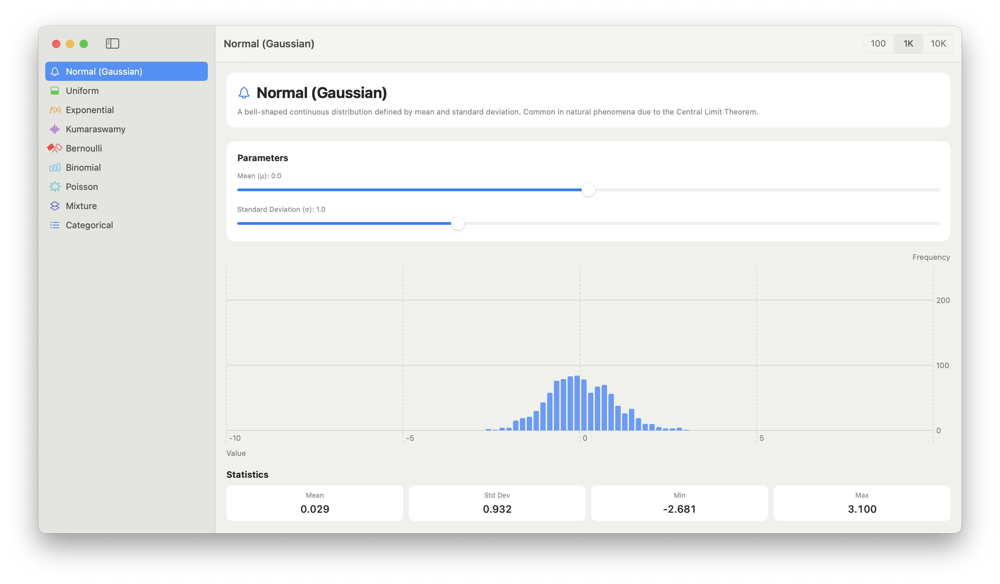
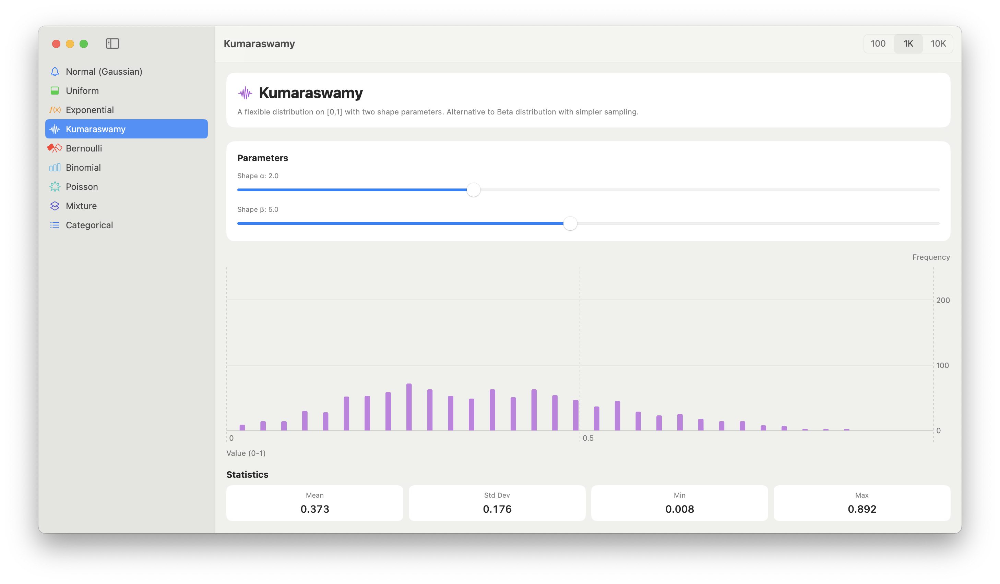

# Uncertain Distribution Visualizer

A macOS app that provides interactive visualizations of probability distributions
from the [`Uncertain<T>`](https://github.com/mattt/Uncertain) Swift package.
Built with SwiftUI and [Swift Charts](https://developer.apple.com/documentation/charts)
to help users develop intuition about statistical distributions.

## Requirements

- Xcode 16+
- macOS 15+

## Screenshots

### Normal Distribution

<picture>
  <source media="(prefers-color-scheme: dark)" srcset="./Assets/normal-dark.png">
  
</picture>

### Uniform Distribution

<picture>
  <source media="(prefers-color-scheme: dark)" srcset="./Assets/uniform-dark.png">
  
</picture>

### Exponential Distribution

<picture>
  <source media="(prefers-color-scheme: dark)" srcset="./Assets/exponential-dark.png">
  
</picture>

### Kumaraswamy Distribution

<picture>
  <source media="(prefers-color-scheme: dark)" srcset="./Assets/kumaraswamy-dark.png">
  
</picture>

### Bernoulli Distribution

<picture>
  <source media="(prefers-color-scheme: dark)" srcset="./Assets/bernoulli-dark.png">
  
</picture>

### Binomial Distribution

<picture>
  <source media="(prefers-color-scheme: dark)" srcset="./Assets/binomial-dark.png">
  
</picture>

### Poisson Distribution

<picture>
  <source media="(prefers-color-scheme: dark)" srcset="./Assets/poisson-dark.png">
  
</picture>

### Mixture Distribution

<picture>
  <source media="(prefers-color-scheme: dark)" srcset="./Assets/mixture-dark.png">
  
</picture>

### Categorical Distribution

<picture>
  <source media="(prefers-color-scheme: dark)" srcset="./Assets/categorical-dark.png">
  
</picture>

## License

This project is available under the MIT license. 
See the LICENSE file for more info.
